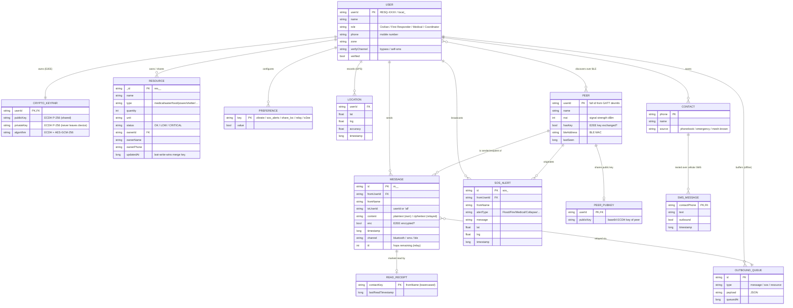
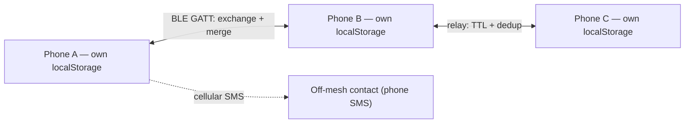

# RESQ — Entity-Relationship Diagram

RESQ is **offline-first**: there is no central database. Every device keeps its
**own** copy of the data in the phone's `localStorage`, and copies are
**exchanged + merged** with nearby devices over the **Bluetooth mesh**. The
diagram below models the *logical* entities and how they relate.

---

## ER Diagram

---

## How each entity is stored (localStorage)

| Entity | localStorage key | Notes |
|---|---|---|
| **USER** | `resq_uid`, `resq_name`, `resq_role`, `resq_mobile`, `resq_zone`, `resq_verify_channel` | The device owner / mesh node identity |
| **CRYPTO_KEYPAIR** | `resq_e2ee_priv`, `resq_e2ee_pub` | ECDH P-256 keypair (Web Crypto API) |
| **PEER_PUBKEY** | `resq_e2ee_peers` | Map of `userId → public key` of known peers |
| **PEER** | in-memory + `resq_nodes` | Discovered nearby devices (live BLE) |
| **MESSAGE** | `resq_bt_history` | Last 300 mesh messages (deduped by id) |
| **SOS_ALERT** | `resq_sos_history` | Last 50 SOS alerts |
| **RESOURCE** | `resq_resources` | Supply items (yours + network), merged by `updatedAt` |
| **CONTACT** | `resq_emergency_contacts`, `resq_known_phones`, `resq_contacts_cache` | SMS + phonebook contacts |
| **SMS_MESSAGE** | `resq_sms_<phone>` | Per-contact SMS thread history |
| **LOCATION** | `resq_location`, `resq_location_history` | GPS fixes |
| **PREFERENCE** | `resq_pref_*` | Settings toggles (vibrate, sos_alerts, share_loc) |
| **READ_RECEIPT** | `resq_read_map` | Last-read timestamp per contact |
| **OUTBOUND_QUEUE** | `resq_bt_queue`, `resq_msg_queue`, `resq_sos_queue` | Store-and-forward buffers (offline) |

---

## Key relationships explained

- **USER → CRYPTO_KEYPAIR (1:1)** — each user generates one ECDH keypair on first
  launch; the public key is shared over BLE, the private key never leaves the phone.
- **USER ↔ PEER (M:N)** — every device discovers many nearby devices over BLE, and
  is itself a peer to them. Identity (`userId`) is resolved from the GATT
  device-info characteristic (not the truncated advertisement).
- **PEER → PEER_PUBKEY (1:1)** — on connect, peers exchange public keys; this is
  what lets two users hold an **E2EE** conversation that relays can't read.
- **USER → MESSAGE (1:N)** — a user authors many messages. `to = 'all'` is a
  broadcast; otherwise it is a direct (encrypted) message routed by `userId`.
- **MESSAGE → READ_RECEIPT (1:0..1)** — opening a chat stamps a read time per
  contact, so threads move out of "unread".
- **USER → RESOURCE (1:N)** — a user owns supply items; edits broadcast over the
  mesh and merge on other devices using **last-write-wins** (`updatedAt`).
- **CONTACT → SMS_MESSAGE (1:N)** — the SMS tab keeps a separate per-contact
  thread, sent over **cellular SMS** (reaches people off the mesh).
- **MESSAGE/SOS/RESOURCE → OUTBOUND_QUEUE** — when no peer is in range, items are
  queued and **flushed** when a device comes back into Bluetooth range
  (store-and-forward / delay-tolerant networking).

---

## Sync model (not a server — a mesh)

Each phone is an independent replica. There is **no central database** — data
propagates device-to-device over Bluetooth (with TTL + de-duplication for
multi-hop relay), and to off-mesh people via **cellular SMS**.
