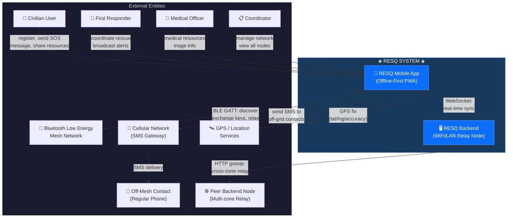
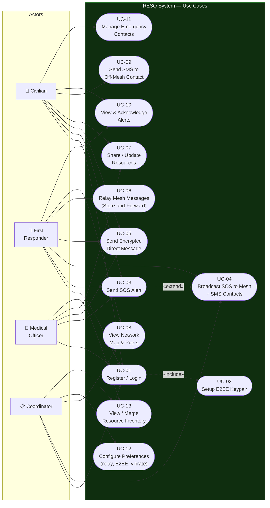
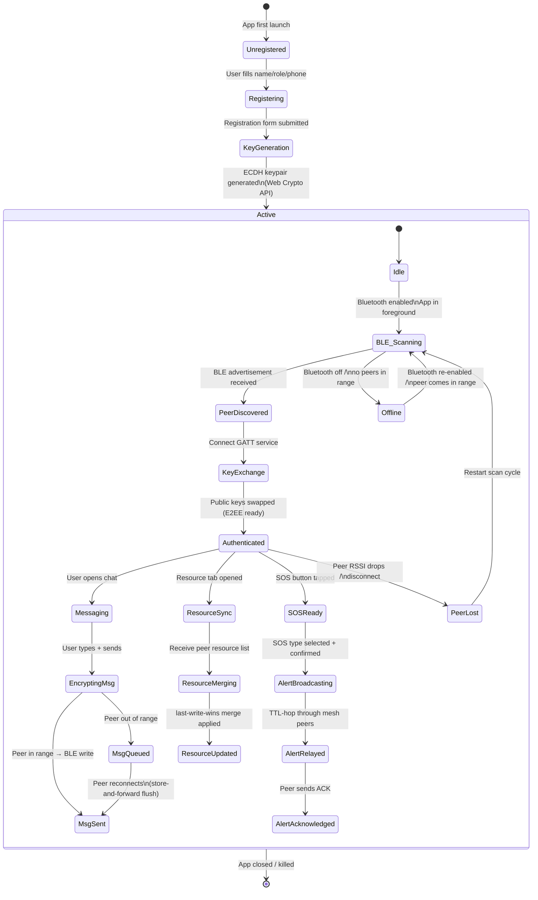
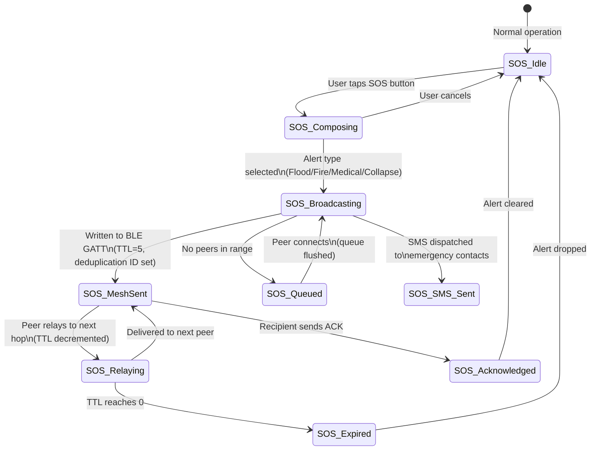
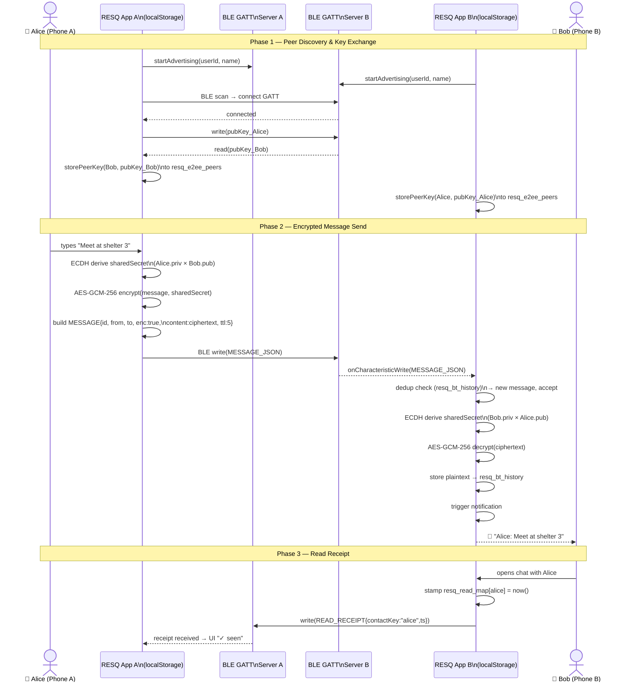
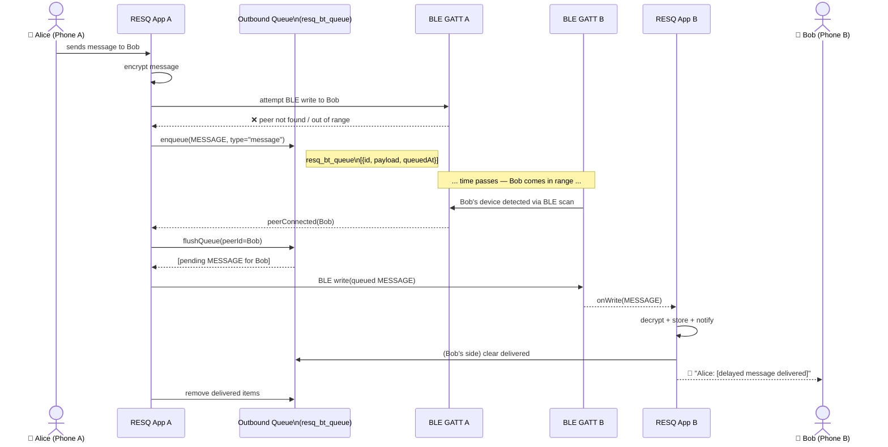
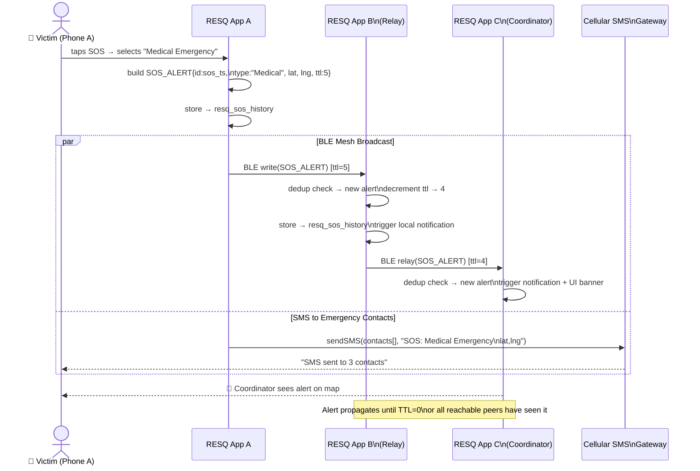

# RESQ — SE-AAT Model Diagrams
**System:** Offline-First Disaster Communication Network (RESQ)

---

## (i) Context Diagram

Shows the RESQ system boundary and all external entities it interacts with.

---

## (ii-a) Use-Case Diagram

Shows all actors and the system use cases they can perform.

---

## (ii-b) State Diagram — App & Connection Lifecycle

Shows all possible states of the RESQ app and the events that trigger transitions.

---

## (ii-c) State Diagram — SOS Alert Lifecycle

---

## (ii-d) Sequence Diagram — E2EE Message Flow (Peer-to-Peer over BLE)

Shows the complete flow of a user sending an encrypted message to a peer via the Bluetooth mesh.

---

## (ii-e) Sequence Diagram — Offline Store-and-Forward (Queued Message Delivery)

Shows what happens when Bob is out of range — the message is queued and delivered when he reconnects.

---

## (ii-f) Sequence Diagram — SOS Broadcast + Multi-Hop Relay

---

## Summary Table of Diagrams

| Diagram | Type | Purpose |
|---|---|---|
| Context Diagram | System Context | System boundary + all external entities |
| Use-Case Diagram | Behavioral | Actors and their interactions with the system |
| App Lifecycle State | State Machine | App, BLE, and peer connection states |
| SOS Alert State | State Machine | SOS alert creation → relay → acknowledgement |
| E2EE Message Sequence | Sequence | End-to-end encrypted chat over BLE GATT |
| Store-and-Forward Sequence | Sequence | Offline message queuing and delayed delivery |
| SOS Broadcast Sequence | Sequence | Multi-hop SOS relay + parallel SMS dispatch |
